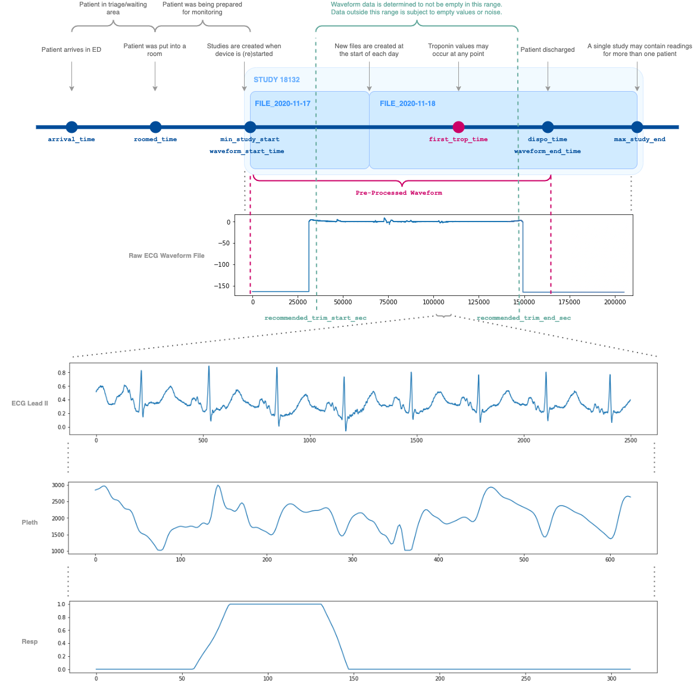

# ED Monitoring Data Processing

Collection of utilities to process ED monitor files.

## `edm`
`edm` is a Pytorch Lightning module to help train machine learning models on the ED waveform data.

Install the `edm` locally by running `pip install .` from the `edm` directory.

## Raw Data

The raw data represents the data exported from the Philips IntelliVue system. 

### Folder Structure
Root folder for all ED monitoring data (synced from Box):
```
/deep/group/ed-monitor
```

Study folders (named `STUDY-XXXXX`) which contains raw data files pulled off of Philips IntelliVue:
```
/deep/group/ed-monitor/2020_08_23_2020_09_23/
    ExportPatientList_2020.09.23_16.28.37.csv
    data/2020_08_23_2020_09_23/
        STUDY-00001
        STUDY-00002
```

Each study folder (`STUDY-XXXXX`) contains files similar to the the following:
```
STUDY-018087_2020-09-05_00-00-00.clock.txt      <- Used only to extract the start time
STUDY-018087_2020-09-05_00-00-00.CO2.dat        <- CO2 waveform (only available for limited studies)
STUDY-018087_2020-09-05_00-00-00.EctSta.txt     <- Not used
STUDY-018087_2020-09-05_00-00-00.hea            <- Header file for all waveforms
STUDY-018087_2020-09-05_00-00-00.II.dat         <- ECG data for Lead II
STUDY-018087_2020-09-05_00-00-00.II.pace.txt    <- Not used
STUDY-018087_2020-09-05_00-00-00.info           <- Information file on sampling rate, gain, etc.
STUDY-018087_2020-09-05_00-00-00.numerics.csv   <- Information on spO2 and other vital signs over time
STUDY-018087_2020-09-05_00-00-00.Pleth.dat      <- Plethysmograph waveform (available for most studies)
STUDY-018087_2020-09-05_00-00-00.Resp.dat       <- Respiration waveform (available for most studies)
STUDY-018087_2020-09-05_00-00-00.RhySta.txt     <- Not used
STUDY-018087_2020-09-05_00-00-00.SQI.txt        <- Not used
STUDY-018087_2020-09-05_00-00-00.timeJump.txt   <- Not used
```

### Cohort Files
Contains general information on each patient visit.
```
/deep/group/ed-monitor/cp_cohort_v1.csv
```

This file is expected to have the following structure, in order to be compatible with the pre-processing scripts:
```
CSN	MRN	Age	Gender	CC	Triage_acuity	Arrival_time	Arrival_area	Admit_area	First_room	Roomed_time	First_bed	Last_bed	ED_dispo	DC_dispo	Dispo_time	Admit_time	Departure_time	Admit_service	ED_LOS	Dx_ICD9	Dx_ICD10	Dx_name	Arrival_to_roomed	CC_CP_SOB	SpO2	RR	HR	Temp	SBP	DBP
123456789012	12345678	64	M	ABDOMINAL PAIN,NAUSEA,EMESIS	3-Urgent	2015-08-01T01:57:00Z	SHC ED 500P ED LOBBY	SHC ED 500P ALPHA Z ZONE	X08	2015-08-01T03:34:00Z	A08	ADULT ED OVRFLW	Admit to Inpatient	Home/Work (includes foster care)	2015-08-01T11:50:00Z	2015-08-01T11:17:00Z	2015-08-01T14:38:00Z	General Surgery	12.68	789.01, 338.19	R10.11	Acute abdominal pain in right upper quadrant	97	0	92	20	126	36.3	129	82
123456789013	12345679	25	F	SHORTNESS OF BREATH,ABDOMINAL PAIN	3-Urgent	2015-08-01T03:40:00Z	SHC ED 500P ED LOBBY	SHC ED 500P ALPHA Z ZONE	X09	2015-08-01T04:36:00Z	A09	A09	Discharge	Home/Work (includes foster care)			2015-08-01T14:06:00Z		10.43	305	F10.10	Alcohol abuse	56	1	98	19	98	36.3	118	80
```

### Bedside Summary Files (Export Patient List)
Each of these files are found at the root of each data ED monitor data range folder. This file contains the study ID, bed label, and patient times which we can use to map to the cohort files.
```
/deep/group/ed-monitor/2020_08_23_2020_09_23/ExportPatientList_2020.09.23_16.28.37.csv 
```

Each file has the following structure:
```
"StudyId","PatientId","ClinicalUnit","BedLabel","LifetimeId","AlternateId","EncounterId","FirstName","MiddleName","LastName","Name","Gender","AdmitState","StartTime","Start?","EndTime","Discharged","ExportStartTime","ExportEndTime"
"STUDY-024636","0172dd32-f471-43e1-9df6-1e3573a83396","ED","04DELTA","","","","","","","","GenderUnknown","NotAdmitted","09/10/20 21:11:52","?","09/12/20 20:30:34","","08/23/20 15:00:00","09/23/20 16:00:00"
"STUDY-017322","0193f321-f28a-4ed8-8f55-e66386dd61c0","ED","03CARD","","","","","","","","GenderUnknown","NotAdmitted","08/30/20 18:24:51","?","08/30/20 20:12:59","","08/23/20 15:00:00","09/23/20 16:00:00"
```

Contrary to header labels, the patient information is never actually provided here. Instead, the following pre-processing steps will utilize the bed label and start/end times to map to the cohort file.

## Data Pre-Processing

Refer to [this notebook](https://github.com/stanfordmlgroup/aihc-win21-ed-monitor/blob/main/notebooks/v9/Pre-Processing.ipynb) for a full walk-through of the data pre-processing steps, including the input to the scripts run.

### Matching

The matching step (see above notebook) will match patients to their corresponding beds. This results in two files - example:
```
/deep/group/ed-monitor/patient_data_v9/matched-cohort.csv
/deep/group/ed-monitor/patient_data_v9/matched-export.csv
```

### Consolidating Data

The raw data was pre-processed by extracting the relevant waveforms from the underlying studies and trimming to the time that the patient was actually in the room (based on the `roomed_time` and `dispo_time`). These files are known as the "consolidated" files.



#### Consolidated File Summary
An example of this file is located at: `/deep/group/ed-monitor/patient_data_v9/consolidated.csv`. 

Note that the `filtered` suffix refers to how the file was filtered to remove patients whose `first_trop_time` was before the `roomed_time`. 

The column descriptions:
- `patient_id`: The ID of the patient as defined in the input mapping file produced by Siyu.
- `arrival_time`: The local time the patient arrived in the ED.
- `roomed_time`: The local time the patient was assigned to a room.
- `dispo_time`: The local time the patient was disposed/left the room.
- `waveform_start_time`: The local time the waveform data actually starts.
- `waveform_end_time`: The local time the waveform data actually ends.
- `visit_length_sec`: The difference between `dispo_time` and `roomed_time` in seconds.
- `data_length_sec`: The waveform length in seconds. This value is 0 if the waveforms could not be extracted properly. Note that even if the waveforms exist, the waveforms may not contain consistent data (e.g. the waveforms are flat-line).
- `min_study_start`: The start time of the earliest study relevant to the patient.
- `max_study_end`: The end time of the latest study relevant to the patient.
- `data_available_offset_sec`: The max between 0 and the difference between the `min_study_start` and `roomed_time`. 
- `data_start_offset_sec`: The difference between the `min_study_start` and `roomed_time`. If this value was negative, this means the study started before the patient was in the room.
- `recommended_trim_start_sec`: The recommended start offset to trim, in seconds, from the beginning of the waveform file, based on what data was detected to be available within range.
- `recommended_trim_end_sec`: The recommended end offset to trim, in seconds, from the beginning of the waveform file, based on what data was detected to be available within range.
- `II_available`: 1 if the Lead II data was available, 0 otherwise. 
- `Pleth_available`: 1 if the Pleth data was available, 0 otherwise.
- `Resp_available`: 1 if the Resp data was available, 0 otherwise.
- `studies`: The set of studies that contributed to the patient.
- `trimmed`: Flag to indicate whether trim was applied during the consolidation script.
- `first_trop_time`: The local time when the first troponin measure was obtained.
- `max_trop_time`: The local time when the max troponin measure was obtained.
- `spo2`: The SpO2 as measured upon admittance. 
- `hr`: The heart rate as measured upon admittance. 
- `bp_sys`: The systolic blood pressure	as measured upon admittance. 
- `bp_dia`: The diastolic blood pressure as measured upon admittance.
- `temp`: The temperature in Celsius as measured upon admittance.
- `first_trop`: The first troponin value. 0 may indicate a non-detectable amount of troponin or that no troponin test was done.
- `max_trop`: The max troponin value, if multiple troponin tests are done. 
- `outcome`: 1 if ACS, 0 otherwise.
- `notes`: If the patient was processed successfully, this value is empty. Otherwise, a message is shown indicating why the patient was not processed. 

#### Consolidated Folder Structure
An example folder that contains all of the pre-processed waveforms is located at:
```
/deep/group/ed-monitor/patient_data_v9/patient-data/<Patient ID>
```

The `v9` suffix here denotes that the dataset contains patients extracted between Aug 2020 - Aug 2021. Different datasetse were generated as more data was incrementally made available.

Each patient folder contains the following consolidated files. Note that all waveforms are pre-trimmed according to the `roomed_time` and `dispo_time` (to the extent that the data is available) but it is recommended to apply the `recommended_trim_start_sec` and `recommended_trim_end_sec` values during actual usage of the data. 
- `numerics.csv`: CSV containing the ECG features automatically extracted by the Philips monitor.
- `{I, II, III, V, aVR}.dat.npy`: 1-D NumPy array containing the ECG waveform of the corresponding leads (at 500 Hz). 
- `info.pkl`: A serialized Pickle object containing metadata similar to what was described in the above summary file (for convenience).
- `Pleth.dat.npy`: 1-D NumPy array containing the Pleth waveform (at 125 Hz).
- `Resp.dat.npy`: 1-D NumPy array containing the Pleth waveform (at 62.5 Hz).

### Filtering

Multiple patients were excluded due to reasons such as missing data files, empty waveforms, or ambiguous bed times. The full flow is detailed in the [notebook](https://github.com/stanfordmlgroup/aihc-win21-ed-monitor/blob/main/notebooks/v9/Pre-Processing.ipynb).

An example of this file is located at: `/deep/group/ed-monitor/patient_data_v9/consolidated.csv`. 

### Train/Val/Test Data
The filtered consolidated file was then split into a train/val/test dataset as described the [notebook](https://github.com/stanfordmlgroup/aihc-win21-ed-monitor/blob/main/notebooks/v9/Pre-Processing.ipynb).

## Waveform Sampling
In the extracted consolidated dataset, each patient may have multiple hours worth of waveform data. To facilitate downstream training, we can extract random or continuous waveform segments. 

For most experiments, we extracted random ten waveforms from the consolidated files that we later passed through a pre-trained Transformer-based model to obtain embeddings. The final embeddings were produced by averaging the ten embeddings.

The script to accomplish this is the following, containing example input (note that this may run for several hours so it is advisable to submit a SLURM job):

```
python -u processing/prepare_ed_waveforms.py -i /deep/group/ed-monitor/patient_data_v9/consolidated.filtered.csv -d /deep/group/ed-monitor/patient_data_v9/patient-data -o /deep/group/ed-monitor/patient_data_v9/waveforms -l 15 -f 500 -n -w II -m 10 -b First_trop_result_time-waveform_start_time
```

Note the following parameters to this script:
- `-i`: The consolidated input file (from above).
- `-l`: The length of the waveforms to sample (in seconds). 
- `-f`: The frequency of the waveform to sample from.
- `-n`: Normalizes the waveforms.
- `-w`: The type(s) of waveforms to work on.
- `-m`: The number of waveforms to sample per patient.
- `-b`: Waveforms should be sampled from before this column (in seconds since waveform start). This is useful since sometimes we only want waveforms from before a lab collection time.
- `-o`: The output folder - in this case the waveforms will be dropped to `/deep/group/ed-monitor/patient_data_v9/waveforms`.

The output of this script will be the following directory format:

```
/deep/group/ed-monitor/patient_data_v9/waveforms/
    15sec-500hz-1norm-10wpp/
        waveforms.dat.npy
        summary.csv
```

#### Waveforms Summary File

The `summary.csv` file is an index into the waveforms 2D NumPy array, where each row in this file corresponds to the row in the NumPy array. The file also indicates where in the original waveform the sampled waveform came from. Note that since we have chosen to sample 10 waveforms per patient, there are 10 rows per record. A `record_name` is the same as the `patient_id` or `CSN`.

```
record_name,pointer
831309290000,1263036
831309290000,132258
831309290000,395342
831309290000,840013
831309290000,701279
831309290000,422066
831309290000,1437245
831309290000,2029409
831309290000,2152970
831309290000,550134
831309290001,331637
831309290001,728771
831309290001,413427
...
```

##### Getting Original Waveform Given Embedding File
Let's say we wanted to see the first waveform for patient `831309290001`. 
1. Read the file located at `/deep/group/ed-monitor/patient_data_v9/patient-data/831309290001/II.dat.npy` into a NumPy array using `np.load(...)`
2. The waveform will be located at: `waveform[1263036:1263036+15*500]`.

#### Waveforms NumPy Array

The `waveforms.dat.npy` is a single 2D NumPy array containing the extracted and sampled waveforms. It has the dimensions `(n, l*f)`, where `n` is the number or rows in the summary file, `l` is the length of the sampled waveform in seconds, and `f` is the frequency of the waveform.

## Embedding Extraction

Waveforms are nice, but the real power comes from creating embeddings from a pre-trained deep learning model. To do this, we can run the following script:

```
python -u processing/apply_pretrained_transformer.py -i /deep/group/ed-monitor/patient_data_v9/waveforms/15sec-500hz-1norm-10wpp/II -m /deep/u/tomjin/aihc-aut20-selfecg/prna/outputs-wide-64-15sec-bs64/saved_models/ctn/fold_1/ctn.tar -d 64
```

This script takes the waveform array produced previously and, for each waveform, runs it through the pretrained model provided as input. If there are multiple waveforms per patient, the embeddings will be averaged for the patient.

Depending on the embedding script run, it will produce files similar to the following structure:

```
/deep/group/ed-monitor/patient_data_v9/waveforms/15sec-500hz-1norm-10wpp/
    transformer-64/
        embeddings.dat.npy
        embeddings_summary.csv
```

While this script demonstrates how you may run the file for a pre-trained Transformer model, similar scripts also exist for pre-trained SimCLR and PCLR models. See the respective scripts for more details.

#### Embeddings Summary File

The `embeddings_summary.csv` file is an index into the waveforms 2D NumPy array, where each row in this file corresponds to the row in the NumPy array.

```
record_name
831309290001
831309290002
831309290003
831309290004
...
```

#### Embeddings NumPy Array

The `embeddings.dat.npy` is a single 2D NumPy array containing the extracted and sampled waveforms. It has the dimensions `(n, d)`, where `n` is the number or rows in the summary file, `d` is the size of the embedding.


## Numerics Extraction

Numerics files are generated alongside the waveform files. They contain data produced by the bedside monitor, and generally correspond to the information displayed on the bedside monitor screen. The data may be slightly different for each patient.

An example file is:

```
Date,Time,Diff,Sequence,SpO2,Pulse (SpO2),NBPs,NBPd,NBPm,Perf,Normal Beats,Supra-ventricular Beats,Supra-ventricular Premature Beats,PVC Beats,Number of Multiform PVCs,Number of R-on-T PVC Beats,Number of PVC Pairs,Total Beats,Percent Ventricular Trigeminy,Percent Ventricular Bigeminy,Pause Events,Number of SVPB Runs,Maximum HR in SVPB Runs,Minimum HR in SVPB Runs,Number of V? Runs,Number of PVC Runs,Maximum HR in PVC Runs,Minimum HR in PVC Runs,Longest PVC Run,Atrial Paced Beats,Ventricular Paced Beats,Dual Paced Beats,Total Paced Beats,Percent of Beats that were Paced,Percent Paced Beats that were Atrially Paced,Percent Paced Beats that were Dual Paced,Percent Paced Beats that were Ventricularly Paced,Number of Paced Runs,Maximum HR in Paced Runs,Minimum HR in Paced Runs,Number of Pacer Not Pacing Events,Number of Pacer Not Capture Events,Percent Irregular Heart Rate,pNN50,Square Root of NN Variance,Percent Poor Signal
07/02/2021, 21:04:47.000 -07:00, 00:00:00.000,678557127136,,,119,80,90,,,,,,,,,,,,,,,,,,,,,,,,,,,,,,,,,,,,,
07/02/2021, 21:04:50.103 -07:00, 00:00:03.103,678557090240,,,,,,,0,0,0,0,0,0,0,0,0,0,0,0,0,0,0,0,0,0,0,0,0,0,0,0,0,0,0,0,0,0,0,0,0,0,0,0
07/02/2021, 21:05:33.143 -07:00, 00:00:43.040,678557133280,99,76,,,,,,,,,,,,,,,,,,,,,,,,,,,,,,,,,,,,,,,,
```

Because this file is messy and sometimes difficult to follow, we can extract the data out for each patient who we are interested in. This can be run using the following command, using the matched cohort file from one of the earlieset steps as a starting point. Note that the example below uses a different folder than previous arguments, but that is because we never ran the numerics extraction on the myocardial injury project.

```
python prepare_ed_numerics_from_matched_cohort.py -i /deep/group/physiologic-states/v1/matched-cohort.csv -d /deep/group/ed-monitor/2020_08_23_2020_09_23,/deep/group/ed-monitor/2020_09_23_2020_11_30,/deep/group/ed-monitor/2020_11_30_2020_12_31,/deep/group/ed-monitor/2021_01_01_2021_01_31,/deep/group/ed-monitor/2021_02_01_2021_02_28,/deep/group/ed-monitor/2021_03_01_2021_03_31,/deep/group/ed-monitor/2021_04_01_2021_05_12,/deep/group/ed-monitor/2021_05_13_2021_05_31,/deep/group/ed-monitor/2021_06_01_2021_06_30,/deep/group/ed-monitor/2021_07_01_2021_07_31 -o /deep/group/physiologic-states/v1/processed -p 100
```

Note the following parameters to this script:
- `-i`: The consolidated input file (from above).
- `-d`: A comma separated list of directories where the raw files are found. 
- `-o`: The output folder - in this case the numerics data will be dropped to `/deep/group/pulmonary-embolism/v2`.
- `-p`: The maximum number of patients to process (you should leave this out if you want to run this on the full consolidated file).

If the script exits prematurely, it can be safely restarted with the same input.

#### Numerics Summary File

A summary file of what numerics files were produced, including the lengths and availability of each extracted measure.

```
csn,HR_len,RR_len,SpO2_len,NBPs_len,NBPd_len
831309290001,6854,6849,7861,10,10
831309290002,919,1029,555,0,0
...
```

#### Numerics Output Files

A Pickle object is produced for each patient with this script the following folder structure:

```
/deep/group/physiologic-states/v1/processed/
    
    00/
        831309290000.pkl
        831309300000.pkl
    01/
        831309290001.pkl
        831309300000.pkl
    ...
```

Note that the subfolders are used to make the file listing manageable, and are based on the last two digits of each patient ID or CSN.

Each pkl file contains the folowing keys (which may change depending on what fields the script is configured to extract). Also note that the lengths of each numeric value (e.g. HR, RR) may be different as they are recorded in different time intervals:

- `patient_ids`: A list of patient IDs, the order of which will correspond to the order of the remaining keys below. This list has size `n`, where `n` be the number of patient IDs. 
- `HR`: A list of recorded heart rate values.
- `HR-time`: A list of date time objects of when each measure was taken. Corresponds to the HR list.
- `SpO2`: A list of recorded SpO2 values.
- `SpO2-time`: A list of date time objects of when each measure was taken. Corresponds to the SpO2 list.
- `RR`: A list of recorded respiratory rates.
- `RR-time`: A list of date time objects of when each measure was taken. Corresponds to the RR list.
- `NBPs`: A list of recorded non-invasive systolic blood pressure values.
- `NBPs-time`: A list of date time objects of when each measure was taken. Corresponds to the NBPs list.
- `NBPd`: A list of recorded non-invasive diastolic blood pressure values.
- `NBPd-time`: A list of date time objects of when each measure was taken. Corresponds to the NBPd list.

## Training

Refer to [this notebook](https://github.com/stanfordmlgroup/aihc-win21-ed-monitor/blob/main/notebooks/v9/Prediction%20-%20Transformer.ipynb) on how you can use the extracted embeddings to train downstream models using the `edm` library.
